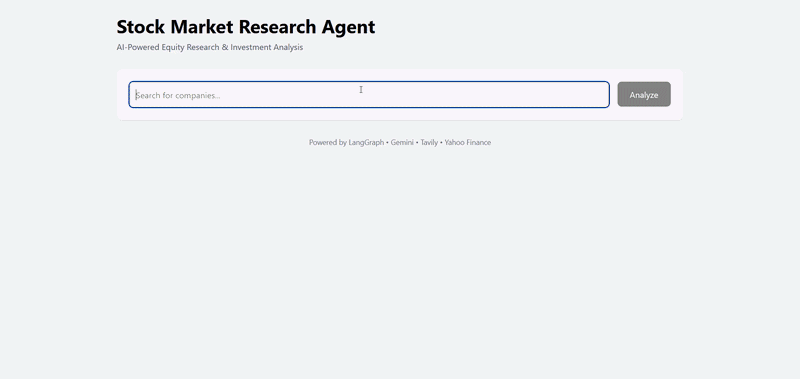

# Stock Market Research Agent

<p align="center">
  
</p>


An AI-powered equity research platform that automates company analysis through a team of specialized agents. By combining real-time market data, financial fundamentals, news intelligence, competitor benchmarking, and risk assessment, the system generates comprehensive research reports that help users quickly understand a company's business, performance, and investment outlook.

## Features

* Multi-agent research workflow using LangGraph
* Company search with autocomplete
* Financial analysis using Yahoo Finance
* Real-time news intelligence via Tavily
* Competitor benchmarking and market positioning
* AI-generated risk assessment
* Professional research report generation
* Interactive React dashboard
* Real-time analysis progress tracking
* Dockerized development environment


## Architecture

```text
User
  │
  ▼
React Dashboard
  │
  ▼
FastAPI Backend
  │
  ▼
LangGraph Workflow
  │
  ├── Coordinator Agent
  ├── News Research Agent
  ├── Financial Analysis Agent
  ├── Competitor Analysis Agent
  ├── Risk Assessment Agent
  └── Report Generation Agent
  │
  ▼
Final Research Report
```

## Agent Workflow

### Coordinator Agent

* Receives selected company and ticker
* Initializes workflow state
* Routes tasks across specialized agents

### News Research Agent

* Collects recent company-related news
* Identifies important developments and market sentiment

### Financial Analysis Agent

* Retrieves company fundamentals from Yahoo Finance
* Evaluates financial performance and valuation metrics

### Competitor Analysis Agent

* Benchmarks the target company against key competitors
* Evaluates competitive positioning and market leadership

### Risk Assessment Agent

* Analyzes operational, financial, and market risks
* Generates an AI-based risk rating

### Report Generation Agent

* Consolidates all research outputs
* Produces a structured investment research report


## Tech Stack

### Backend

* FastAPI
* LangGraph
* LangChain
* Google Gemini
* Yahoo Finance
* Tavily Search

### Frontend

* React
* Vite
* Axios
* Tailwind CSS
* React Markdown

## Getting Started

### Prerequisites

* Python 3.10+
* Node.js 20+
* Docker (optional)

### Environment Variables

Create a `.env` file:

```env
GEMINI_API_KEY=your_gemini_api_key
TAVILY_API_KEY=your_tavily_api_key
```
## Local Development

### Backend

```bash
pip install -r requirements.txt

uvicorn main:app --reload
```

Backend:

```text
http://localhost:8000
```

Swagger UI:

```text
http://localhost:8000/docs
```
### Frontend

```bash
cd frontend

npm install

npm run dev
```

Frontend:

```text
http://localhost:5173
```

## Docker Setup

Build and start the complete application:

```bash
docker compose up --build
```

Frontend:

```text
http://localhost:5173
```

Backend:

```text
http://localhost:8000
```

## Example Workflow

1. Search for a publicly traded company
2. Select a company from autocomplete results
3. Launch analysis
4. Monitor agent progress in real time
5. Review generated financial research report

## Disclaimer

This project is intended for educational and research purposes only.

The generated analysis should not be considered financial advice, investment recommendations, or professional research.
